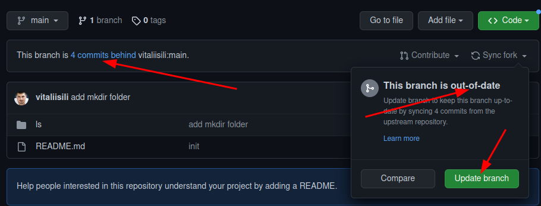

# Linux Commands

* * *

# How to contribute

#### 1. Check if you Fork [vitaliisili/linux-commands](https://github.com/vitaliisili/linux-commands) repository
#### 2. Click **Fork button**

#### 3. Insert repository name, default is "**linux-commands**" and click green button **Create Fork**
#### 4. Check repository and clone to local repository:
   - ###### Check repository name should be `<your-nickname>/linux-commands`
   - ###### Press green button **Code**
   - ###### Choose **HTTPS** or **SSH** and copy the link


#### 5. Open terminal and go to your work directory
#### 6. Clone repository `git clone <remote-link>`
   ``` bash
   git clone https://github.com/YOURN_NIKNAME/REPOSITORY_NAME
   ```
#### 7. Go to `<project-folder>`
   ```bash
   cd <project-folder>
   ```
#### 8. Open this folder in your favorite **IDE** example for **Visual Studio Code** type
   ```bash
   code .
   ```

* * *

# Project Recommendations

#### 1. Is recommended to create new branch
#### 2. For each command create new folder that represent linux command example for `mkdir command` folder should be named "**mkdir**"
#### 3. Inside folder create a file with "**md**" extension example "*mkdir-command.md*"
#### 4. Project tree example:

#### 5. Use "Markdown syntax" to write documentation

<br>

* * *

# Prepare to push
#### 1. Check if remote repository is up to date
 
#### 2. To sync your repository you can set `upstream` **or in your GitHub repository click *`Sync fork`* button and click "Update branch"**
 
#### 3. Update your local repository
   ```bash
   git pull
   ```
#### 4. To save all changes run:
   ```bash
   git add .
   git commit -m "changes comment"
   ```
#### 5. After you did all changes and your local changes are ready to push type
   ```bash
   git push -u origin <branch-name>
   ```
* * *

# Create pull request

#### 1. Go on your GitHub project repository and click "**Pull request**" button

#### 2. Click *New pull request* button

#### 3. If you create new branch select it from drop down menu

#### 4. Check if your changes are able to merge and click **Create pull request** button

#### 5. Add pull request title, leave a comment and click **Create pull request**

#### 6. Wait for review :mag:

